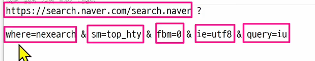

Django Template Language(DTL)
Template(HTML)에서 조건 반복 변수 등의 프로그래밍적 기능을 제공하는 시스템 

render함수의 3번째 인자 => 매개변수 이름을 context로 명칭, 그래서 딕셔너리의 이름을 context라고 하는 편

1. variable
2. Filters
3. Tags

변수, 필터, 반복 및 조건

url -> view함수 ->

view함수 정의할 때 딕셔너리의 키, 밸류 이름은 맞추는 편

### 템플릿 상속
페이지의 공통요소를 포함
하위 템플릿이 재정의 될 수 있는 공간을 부모템플릿에 만들기

자식 템플릿은 무조건!!! 최상단에 작성되어야함
하위 템플릿이 재정의 할 수 있는 영역인 block들의 이름 지정하고 제대로 써야함

 ### 요청과 응답
 로그인 관련해서 HTML의 form과 input태그 함께 다님

FORM 사용자로부터 할당된 데이터를 서버로 전송

form의 핵심속성
action & method
데이터를 어디로action 어떤 방식으로method 보낼 것인지

method get과 post
get: 데이터 검색(조회) -> url에 노출됨
post: 데이터 삭제 수정 생성 조작 (주로 로그인 할 때)

variable routing 한 url로 여러개 작성가능 

앱 폴더마다 url을 만들어주는 구조도 잇음

BASE_DIR = > 

공통으로 할 일을 base.html로 가져옴 => nav bar

form이 입력할 수 있는 박스
form 안에 action은 어디로 갈 것인지 

제출버튼 => type == submit이라고 통칭

url 다 적을 필요 없이 a태그 쓰는 방식으로 action="/todos/"

request는 아주 큰 데이터 구조

url로 todos 요청이 들어오면 views의 index함수가 호출됨

변수 형태로 url 만들기
urls.py로 가서 path 추가 variable routing하려고

클라이언트가 입력한 값을 get의 형식으로 받는다 GET함수 (자매품으로 POST함수도 있음)

urls로 요청 => views => html

### url에 name 붙이기

  

    <a href="">메인 페이지</a>
    <a href="">할 일 추가</a>
  

  todos가 앱, todo_list_project는 프로젝트
  todos 아래에 urls 파일만들고

  include 함수가 뭐지?

  태그 안에 있으면 변수형태로 자동으로 변환됨