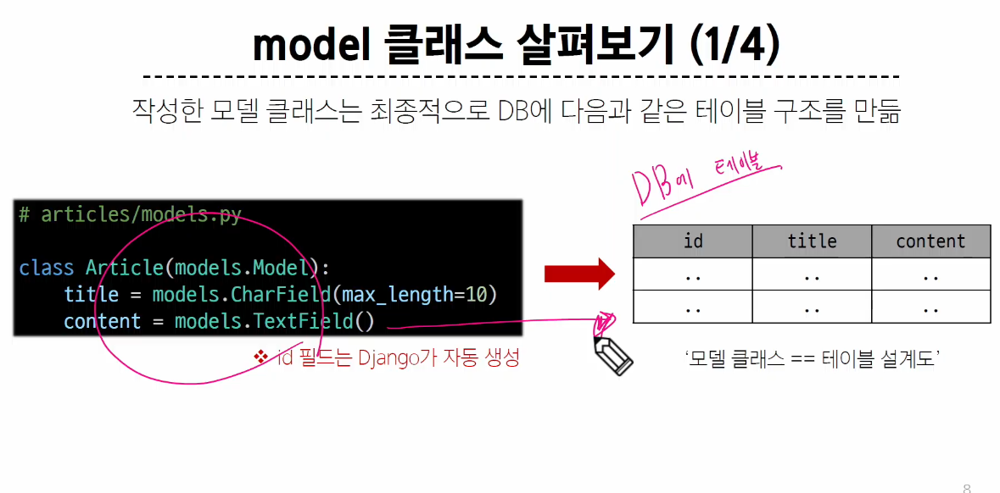
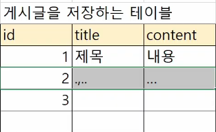
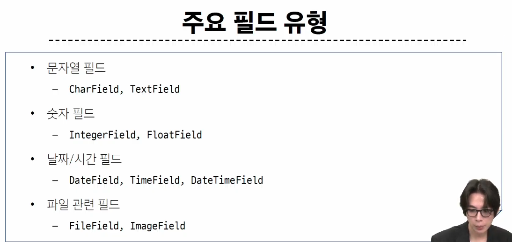
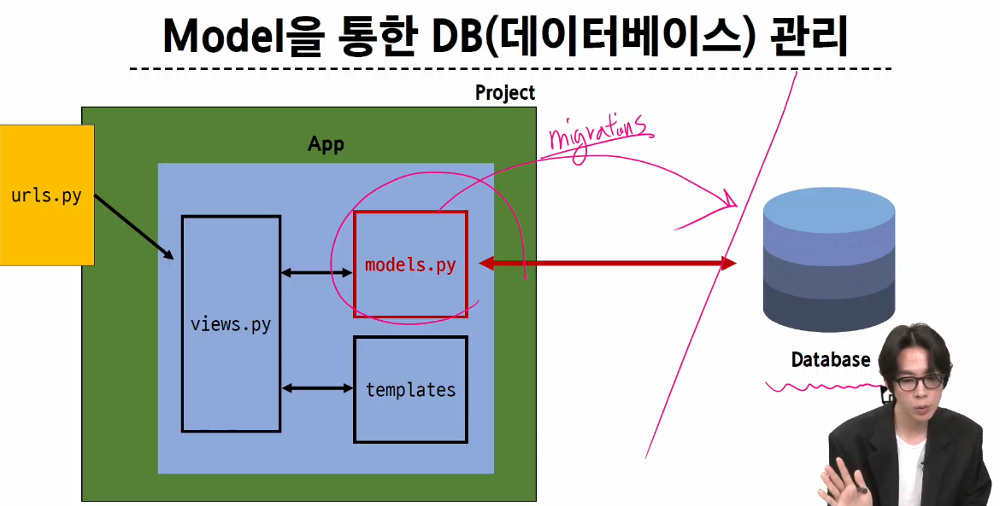
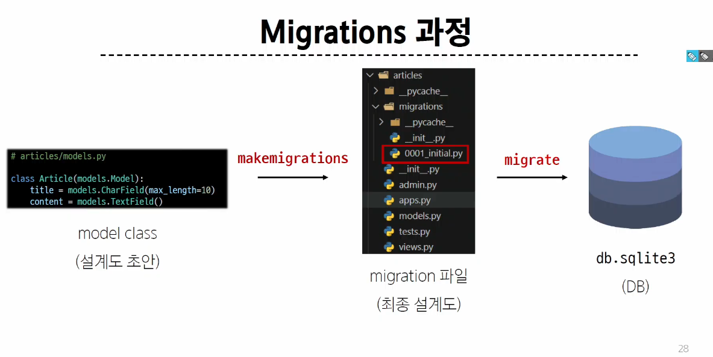
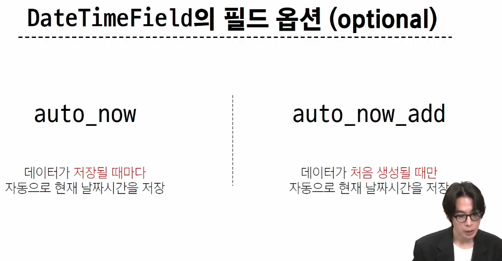
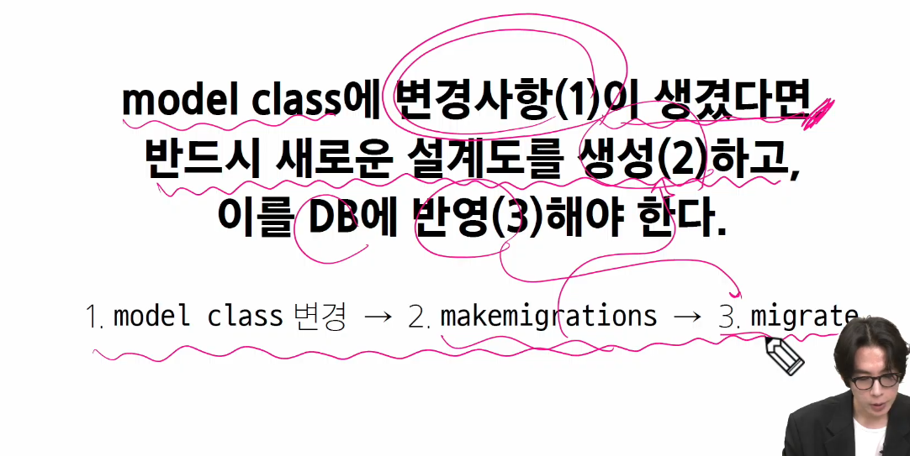

파이썬 7~8일차 수업 클래스, OOP 복습 필요

Model을 통한 DB 관리
Model이 db와의 소통을 통해 요청함

### Django Model
db의 테이블을 정의하고 데이터를 조작(생성, 조회, 수정, 삭제)(aka CRUD) 할 수 있는 기능들을 제공

파이썬과 데이터베이스가 쓰는 언어가 다름.
SQL이라는 언어로 요청을 보내야함.
프레임워크의 장점이 언어를 알아서 SQL언어로 변환해서 DB로 전달해줌

앱폴더에 models.py

속성값,,
대문자이면 대부분 클래스

class Article(models.Model)
Model클래스를 상속. Model 클래스 코드(약 2000줄)를 다 가져오겠다.
2000줄 짜리 기능 위에서 스케치를 한다.
## 테이블 구조를 어떻게 설계할지에 대한 코드만 작성하면 됨(상속을 활용한 프레임워크의 기능 제공) 제로베이스가 아니다

title은 인스턴스
CharField 클래스를 통해 title이라는 인스턴스를 만든다.
문자열 타입 컬럼 생성

TextField 클래스는 인자가 아무것도 없음. 

CharField의 max_length=10 인자는 최대 10글자를 의미

id필드는 장고가 알아서 생성

클래스 변수명 -> 테이블의 각 필드(열) 이름

Model Field 클래스들(CharField, TextField 등)은 어떤 데이터 타입이 들어갈지, 어떤 제약 조건 적용할지 정의함

데이터베이스의 무결성 원칙. age 에 정수가 들어갈 것을 보장해야함
db설계할 때 필드에 어떤 타입(정수)이 들어갈지 정해놓고 들어가야함
제약조건 (최소 15세 이상)

https://docs.djangoproject.com/en/5.1/ref/models/fields/
장고 공식문서 참조

models모듈의 클래스들로 정의되어 있음
CharField()는 무조건 제한된 길이가 있어야함 그래서 max_length가 필수 옵션

TextField는 문자열 필드인데 길이 제한이 없는 대용량 텍스트 저장(사용하는 시스템에 따라 달라짐)

데이터를 db에 저장할 때 유효성 검사를 거침.

### Field Options
필드의 동작과 제약조건을 정의

### Migration

:model 클래스의 변경사항을 db에 최종 반영하는 방법

models.py -> Database

$python manage.py makemigrations
$python manage.py migrate

Migrations for 'articles':
  articles\migrations\0001_initial.py
    - Create model Article
(venv) 
0001_initial.py에 최종 설계도가 저장됐다.

터미널에 명령어 쓰고,, 어떻게 장고가 파일도 만들고 하는거지?

  Applying contenttypes.0001_initial... OK
  Applying auth.0001_initial... OK
  Applying admin.0001_initial... OK
  Applying admin.0002_logentry_remove_auto_add... OK
  Applying admin.0003_logentry_add_action_flag_choices... OK
  Applying articles.0001_initial... OK
  Applying contenttypes.0002_remove_content_type_name... OK
  Applying auth.0002_alter_permission_name_max_length... OK
  Applying auth.0003_alter_user_email_max_length... OK
  Applying auth.0004_alter_user_username_opts... OK
  Applying auth.0005_alter_user_last_login_null... OK
  Applying auth.0006_require_contenttypes_0002... OK
  Applying auth.0007_alter_validators_add_error_messages... OK
  Applying auth.0008_alter_user_username_max_length... OK
  Applying auth.0009_alter_user_last_name_max_length... OK
  Applying auth.0010_alter_group_name_max_length... OK
  Applying auth.0011_update_proxy_permissions... OK
  Applying auth.0012_alter_user_first_name_max_length... OK
  Applying sessions.0001_initial... OK

  우린 Applying articles.0001_initial 라는 설계도만 만들었는데, 다른것들은 왜 생겼지? -> 

    'articles',
    'django.contrib.admin',
    'django.contrib.auth',
    'django.contrib.contenttypes',
    'django.contrib.sessions',
    'django.contrib.messages',
    'django.contrib.staticfiles',
    
  -> articles를 제외한 나머지 애들의 설계도도 추가된것

  db에 migrate할 때 장고가 앱이름_클래스이름 -> 테이블이름으로 짓는다.
  하나의 앱에 여러 models 클래스가 만들어지면, 테이블이 어떤 앱에서 만들어졌는지 알아야하기 때문에

  ### 추가 Migration
  게시글 최신순...
  작성시간이 저장되어있어야 함 -> 두개의 필드 추가(작성시간및날짜/ 수정시간/날짜)

  이미 생성된 테이블에 필드를 추가해야 한다면?
  models.py에서 설계도 스케치를 바꾸자
    created_at = models.DateTimeField(auto_now_add=True)
    updated_at = models.DateTimeField(auto_now=True)

auto_now_add는 생성될 때!
auto_now는 저장될 때마다!

git처럼 데이터베이스의 history를 쌓아가야 잘못된 지점이 있을 때로 돌아갈 수 있다. (버전관리, 유지보수)

### admin site
$python manage.py createsuperuser

계정이 생성되려면 db/테이블이 있어야함

default값이 있는 field도 있음

id / created_at / upadated_at 은 입력을 받는

CharField, TextField 모델필드가 달랐기에 게시글 박스 크기도 맞춤형으로 만들어짐

$ python manage.py showmigrations
admin
 [X] 0001_initial
 [X] 0002_logentry_remove_auto_add
 [X] 0003_logentry_add_action_flag_choices
articles
 [X] 0001_initial
 [X] 0002_article_created_at_article_updated_at
auth
 [X] 0001_initial
 [X] 0002_alter_permission_name_max_length
 [X] 0003_alter_user_email_max_length
 [X] 0004_alter_user_username_opts
 [X] 0005_alter_user_last_login_null
 [X] 0006_require_contenttypes_0002
 [X] 0007_alter_validators_add_error_messages
 [X] 0008_alter_user_username_max_length
 [X] 0009_alter_user_last_name_max_length
 [X] 0010_alter_group_name_max_length
 [X] 0011_update_proxy_permissions
 [X] 0012_alter_user_first_name_max_length
contenttypes
 [X] 0001_initial
 [X] 0002_remove_content_type_name
sessions
 [X] 0001_initial
(venv) 

[X]는 데이터베이스에 모두 반영이 되어 있다라는 의미

SQLite
데이터베이스 관리 시스템 중 하나로 Django의 기본 데이터베이스로 사용됨
파일로 존재하며 가볍고 호환성이 좋음음

프로젝트 폴더에 있는 url파일에서 총 관리하지만
앱이 여러개가 되면 프로젝트 url파일에서는 최상위 것만 관리하고 
나머지는 각 앱폴더에 url파일을만들어 각자 관리한다.

        'BACKEND': 'django.template.backends.django.DjangoTemplates',
        'DIRS': [BASE_DIR / 'templates' ],
        'APP_DIRS': True,

        APP_DIRS : True는 앱폴더에 있는 templates 안에 있는 html을 모두 templates 폴더 안으로 가져오겠다.
        그럼 app1폴더에 있는 거랑 app2에 있는 거랑 구분이 안되니까, app1폴더의 templates 폴더 안에 app1폴더를 하나 더 만들어주고 app2도 마찬가지로 한다. 
        'DIRS' : [BASE_DIR / 'templates'] 는 manage.py파일이 있는 곳의 templates 폴더 안에 html도 가져오겠다.