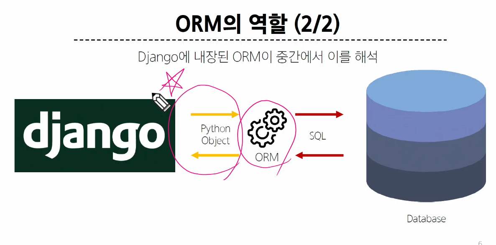
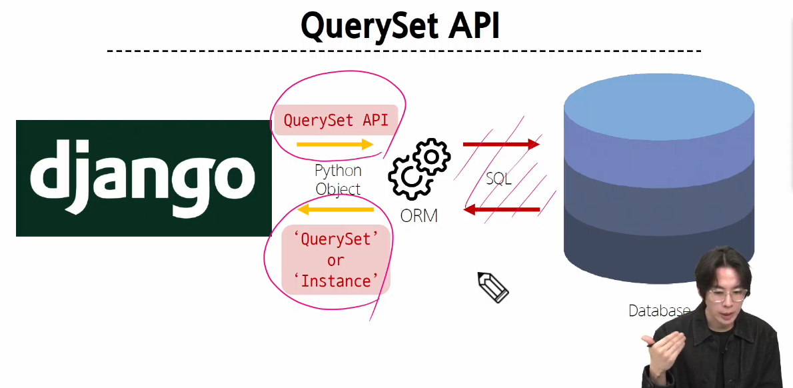
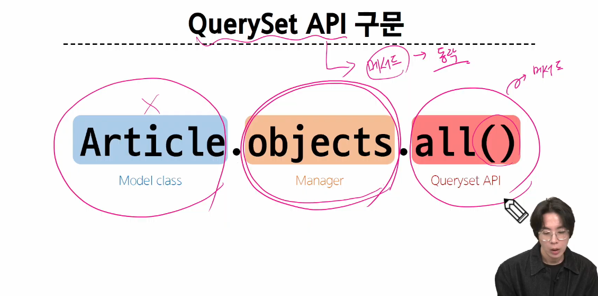
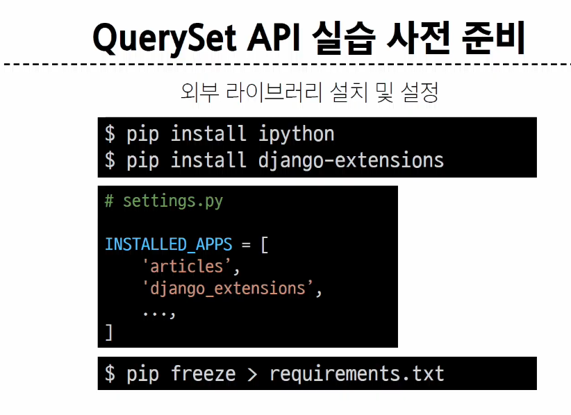
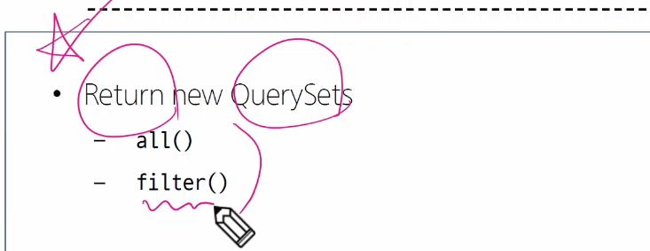

### Object-Relational-Mapping(연결)
  객체지향 프로그래밍 언어를 사용하여 호환되지 않는 유형의 시스템 간에 데이터를 변환하는 기술

### QuerySet API
ORM에서 데이터를 검색, 필터링, 정렬 및 그룹화하는 데 사용하는 도구
-API를 사용하여 PYTHON 코드로 데이터를 처리

### QuerySet API 구문

메서드가 Model클래스에 있는 게 아닌 Manager에 있음

QuerySet -> 다중데이터
Instance -> 단일데이터

메서드가 다중데이터를 반환하냐, 단일데이터를 반환하냐에 따라 나뉜다.

### Query?
데이터베이스에 특정한 데이터를 보여달라는 요청
쿼리문을 작성한다 -> 원하는 데이터 얻기 위해 데이터 베이스에 요청한다.

QuerySet -> 리스트는 아니고 장고에 내장된 데이터타입이지만 리스트처럼 쓸 수 있다.
순회가 가능한(iterable) 데이터로 1개 이상 데이터를 불러와 사용할 수 있음

Django ORM을 통해 만들어진 자료형

데이터베이스가 단일한 객체를 반환 할 때는 모델의 인스턴스로 반환됨

### QuerySet API
PYTHON의 모델클래스와 인스턴스를 활용해 DB에 데이터 CRUD하는 것(저장 조회 갱신 삭제)

### 장고가 권장하는 INSTALLED_APPS 등록 순서 
1. 직접 생성한 app
2. 설치한 앱(3rd party library)
3. 내장 앱

Django shell
Django 환경 안에서 실행되는 python shell
입력하는 QuerySet API 구문이 Django 프로젝트에 영향을 미침

.gitignore를 쓰면 venv 뿐만 아니라
데이터베이스도 원격저장소에 공유하지 않음

$ python manage.py shell_plus

### 데이터 객체를 만드는 생성하는 3가지 방법
인스턴스가 클래스 변수를 채운 다음에~ 
인스턴스(article)가 인스턴스 메서드(save()) 호출하고

인스턴스 메서드는? Model이라는 상속받은 클래스 안에 있음
              모듈.클래스
class Article(models.Model):
    title = models.CharField(max_length=10)
    content = models.TextField()
    created_at = models.DateTimeField(auto_now_add=True)
    updated_at = models.DateTimeField(auto_now=True)

Primary Key -> DB

명령어를 통해 데이터베이스 게시물 전체조회 줘! 할 수 있음

get()은 primary key와 같은 고유성을 보장하는 조회에서만 사용해라. 없어도 에러 다중데이터도 에러이기 때문에...

### update
수정하려면 조회를 먼저 해야함!!!

삭제또한 조회먼저 해야함

조회하고
쿼리셋으로 받고
템플릿으로 보내주면됨

서버실행하고 게시판에 올렸던 걸 파워쉘에서 하는건가?

1. shell_plus
파이썬 프로그램을 view.py에 쓰고있는데, 실행해서 보려면 서버실행해서 html쪽으로 보여줘야만 볼 수 있음
터미널로 보든가

파이썬 프로그램을 한 줄씩 실행하며 보고싶어서 shell_plus 씀

ORM python 문법연습한 것임

2. 객체와 DB

class Student()
    name = 
    age =
a(인스턴스 또는 객체) = Student(name='홍길동', age=25)
b(인스턴스 또는 객체) = Student(name='홍길동', age=25)

a.age = 27
a.save()

b = Student(name='박보검', age=27)
b.save()

Student.objects.creat(name='박보검', age=27)

3. get 과 filter  타입은 QuerySet
s = Student.objects.get(pk=1)
s = Student.objects.filter(name='박보검')

for i in s:
    print(i.name)

DateField
'2025-03-27'

TimeField
'10:23'