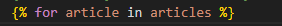
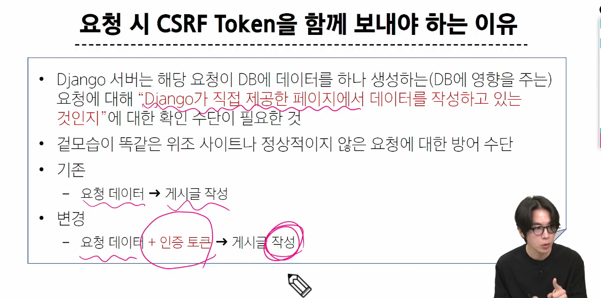
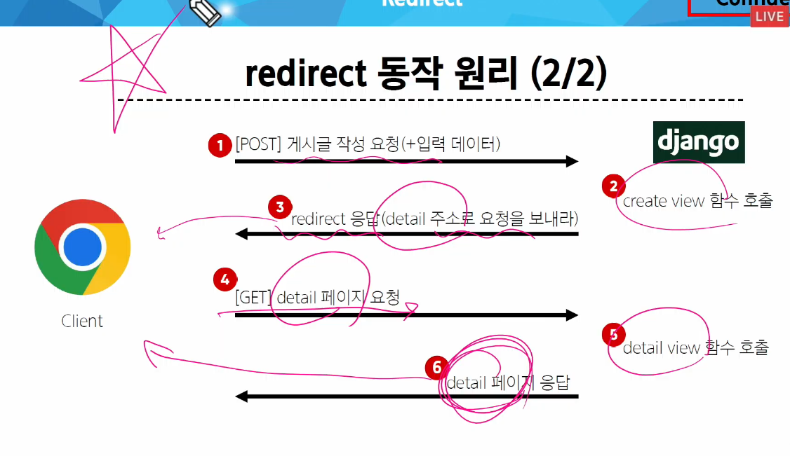
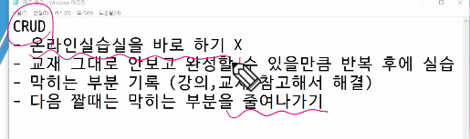

create 로직을 구현하기 위해 필요한 view 함수 개수
1. .사용자 입력데이터를 받을 페이지를 랜더링 하는 함수
2. 사용자가 입력한 요청 데이터를 받아 db에 저장장

  <form action="#" method="GET">
  
  <input type="text" name="title" id="title"> name 꼭 써줘야함함

  #사용자로부터 데이터를 받아 저장하고 저장이 완료되었따는 페이지를 제공하는 함수수
def create(request):
    #사용자로부터 받은 데이터 추출출(request가 그 데이터임임)
    request.GET() -< 여기에 딕셔너리 형태로 되어있음음

views.py index함수에서 가져옴

### HTTP request methods
네트워크 상에서 데이터(리소스)를 주고 받기위한 약속

대표 요청메소드 -> GET, POST

데이터에 대해 수행을 원하는 작업(행동)의 종류를 나타내는 것

GET은 조회 목적일 때만 씀! 하지만 create생성 구현을 GET으로 함

GET method
1. GET은 데이터를 전송할 때 url에 노출이 된다.(Query String parameter)
2. url 길이 제한이 잇어 대량 데이터전송 적합x
3. 브라우저 히스토리
4. 캐싱: 동일한 url로 다시 요청할 때, 서버에 접속하지 않고 저장된 결과를 사용
    첫번째 요청 때 브라우저에 캐싱을 해두기 때문에 페이지로딩시간을 단축  

### POST Method
서버에 데이터를 제출하여 리소스를 변경하는 데 사용

1. HTTP Body를 통해 데이터 전송
2. GET에 비해 더 많은 양의 데이터 전송 가능
3. 브라우저 히스토리에 남지 않아 뒤로가기가 안됨
로그인 정보제출. 파일업로드. 새 데이터 생성. API에서 데이터 변경 요청

GET은 데이터 조회만 
POST는 데이터 생성이나 수정에 주로 사용

GET과 POST의 기술적인 특징과 사용 목적을 알아야함

기술들의 방식이 다를 뿐이다.

### 응답 상태 코드 HTTP response status code
클라이언트에게 요청 처리 결과를 명확히 전달

문제 발생 시 디버깅에 도움

403 Forbidden => 서버에 요청이 전달됐지만 권한 때문에 거절
GET은 조회요청이기 때문에 권한 확인 안함. POST는 조작과 관련된 요청이기에 권한 확인함

### CSRF
사이트 간 요청 위조

POST는 단순 조회를 위한 GET과는 달리 변경(생성, 수정, 삭제)을 요구하는 의미와 기술적인 부분을 가지고 있기 때문
데이터베이스에 대한 변경사항을 만드는 요청이기 때문에 토큰을 사용해 최소한의 신원 확인 하는 것
DB에 조작을 가하는 요청은 반드시 인증 수단이 필요

from django.urls import path
from . import views

app_name = 'garages'

urlpatterns = [
    path('', views.index, name='index'),
    path('new/', views.new, name='new'),
    path('create/', views.create, name='create'),
    path('<int:garage_pk>/edit/', views.edit, name='edit'),
    path('<int:pk>/edit/', views.edit, name='edit'),
    path('<int:garage_pk>/update/', views.update, name='update'),
    path('<int:garage_pk>/delete/', views.delete, name='delete'),
]
->이말은 url 요청 받을 때 정수인지 판별하고 정수면 garage_pk에 담겠다. 그리리고 views.edit 함수가 호출 될 때
매개변수로 들어감감

def edit(request, garage_pk):
    garage = Garage.objects.get(pk=garage_pk)

->여기서 get은 orm구문

request는 자료구조, 객체 POST는 속성 .get()는 딕셔너리 메소드드

### from import
되도록이면 (권장사항) import 다음에는 하나만 남도록 최상위 것만 남겨두기
from에는 상대경로 디렉토리까지는 적어주기
